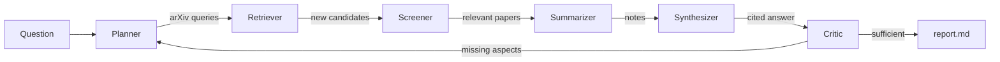

# Research Reviewer Agents

A multi-agent system that answers a research question from the arXiv literature. It searches, filters for relevance, takes grounded notes, writes a cited answer, and keeps searching until a reviewer agent judges the answer sufficient.

> **Looking for the original (2025) version?** It is preserved at the [`v1.0` tag](../../tree/v1.0).
> See [Changes since v1](#changes-since-v1) below.

## How it works



| Agent | Job |
| --- | --- |
| Planner | Writes fielded arXiv queries (`abs:"..." AND ti:...`) for different facets of the question; in later rounds it targets the gaps the Critic found. |
| Retriever | Runs the queries against arXiv (sorted by relevance) and deduplicates against everything seen so far. |
| Screener | Scores each new paper 0-10 for relevance from its abstract; only papers above `--min-score` move on. |
| Summarizer | Extracts question-focused notes from each abstract, without inventing details the abstract doesn't state. |
| Synthesizer | Writes an answer organized by theme with inline citations `[n]`, including open questions and gaps. |
| Critic | Judges coverage, grounding, and evidence strength of the answer against the **original** question; if insufficient, lists missing aspects for the next round. |

The loop stops when the Critic is satisfied, when a round finds no new relevant papers, or after `--max-rounds`.

## Setup

```bash
conda env create -f environment.yml
conda activate research_agents
cp .env.example .env   # then add your API key
```

Or with pip: `pip install -r requirements.txt`.

Supported LLM providers:

- **Anthropic (Claude)**: set `ANTHROPIC_API_KEY` (default model `claude-sonnet-5-5`).
- **OpenAI**: set `OPENAI_API_KEY` (default model `gpt-4.1-mini`). Any OpenAI-compatible endpoint (OpenRouter, Ollama, ...) works via `OPENAI_BASE_URL`.

If both keys are set, choose one with `LLM_PROVIDER=anthropic|openai` or `--provider`.

## Usage

```bash
python main.py "How does curiosity improve exploration in reinforcement learning?"
```

Options:

| Flag | Default | Meaning |
| --- | --- | --- |
| `--max-rounds` | 3 | Maximum search/critique rounds |
| `--queries-per-round` | 4 | arXiv queries the Planner writes per round |
| `--results-per-query` | 10 | arXiv results fetched per query |
| `--min-score` | 6 | Relevance cutoff (0-10) for a paper to be used |
| `--max-papers` | 20 | Maximum papers cited in the answer |
| `--provider` | `$LLM_PROVIDER`, else inferred from API keys | `anthropic` or `openai` |
| `--model` | provider default | Chat model |
| `--output-dir` | `output` | Where reports are written |

## Output

Each run creates `output/<timestamp>_<question-slug>/` containing:

- `report.md`: the cited answer, the Critic's assessment, references, per-paper notes, and the search log.
- `run.json`: the full trace, including every candidate paper with its relevance score and reason. This is useful for debugging retrieval.

See [`examples/curiosity-exploration-rl.md`](examples/curiosity-exploration-rl.md) for a real report. It took 3 rounds and about 2 minutes with Claude Sonnet 5.5.

## Tests

```bash
pytest
```

The tests replace the agents with stubs, so they run offline without an API key.

## Changes since v1

- **Relevance-sorted retrieval.** v1 sorted arXiv results by submission date, so it returned the newest papers matching any keyword rather than the most relevant ones.
- **Relevance screening.** Off-topic papers are scored out before summarization instead of being summarized and passed to the Critic.
- **An actual answer.** A Synthesizer writes a cited answer to the question; v1 only produced a list of per-paper summaries.
- **Grounded summaries.** Notes are restricted to what the abstract states (v1 asked for experiments and limitations an abstract usually doesn't contain).
- **Critic feedback that doesn't drift.** v1 replaced the user's question with the Critic's suggestion. Now the original question is kept, and the Critic's missing aspects drive new searches. Papers accumulate across rounds.
- **Robustness.** JSON-mode responses validated with Pydantic (with automatic repair) replace `ast.literal_eval`, API calls retry, and LLM calls run in parallel.
- **Usability.** CLI arguments replace the hardcoded question, the model is configurable, and each run gets its own output folder.

## Ideas / roadmap

- Full-text retrieval (PDF parsing) for papers that pass screening
- Citation-graph expansion via Semantic Scholar
- Additional sources (OpenReview, PubMed)
- Simple web UI

## Author

Boyuan Wu
